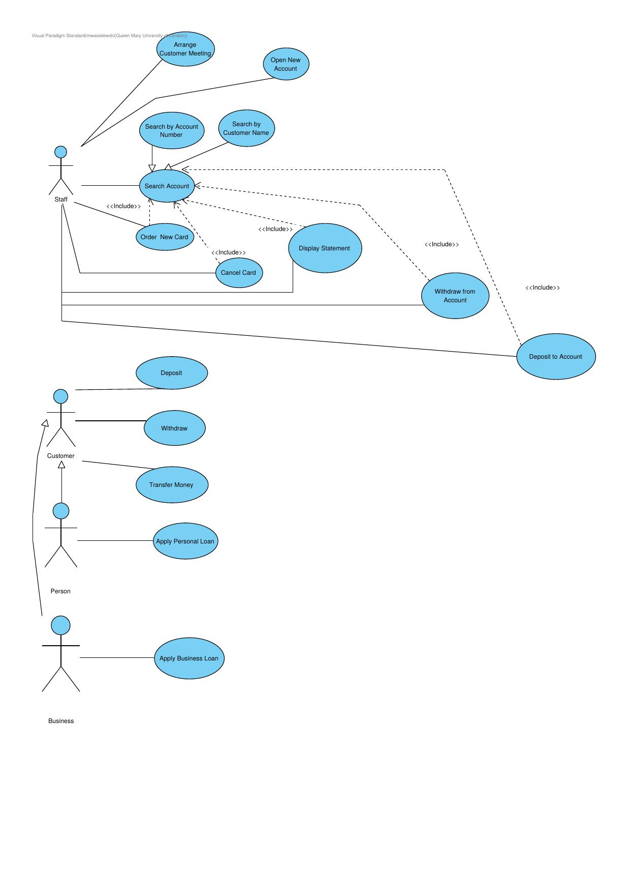
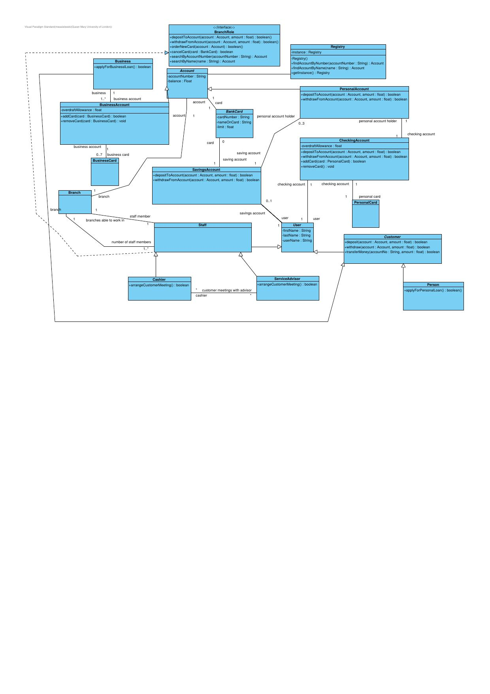
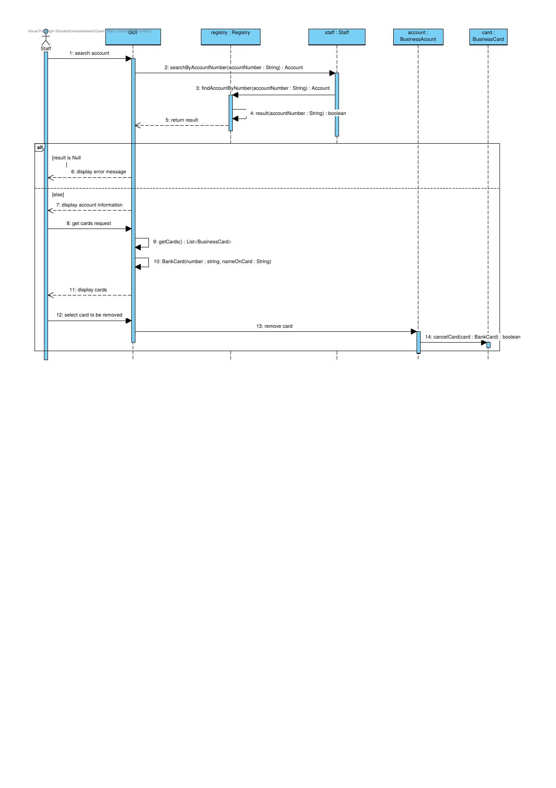

# Process Modelling Portfolio
A collection of UML and BPMN diagrams created across academic and personal projects, 
demonstrating skills in system design, requirements modelling, and business process analysis.

## Skills Learned
- **UML** : Use case, class, and sequence diagrams for object-oriented system design
- **BPMN** : Business process modelling for workflow and process analysis
- **Requirements gathering** : Translating business needs into structured technical diagrams
- **System architecture** : Modelling relationships, interactions, and data flows between components

## Software Used
- Visual Paradigm - UML diagrams
- draw.io - BPMN process models

## Contents

## Banking System - Use Case Diagram
Models the interactions between Staff and Customer actors across core banking operations including account management, card services, and loan applications.

## Banking System - Class Diagram
Defines the object-oriented structure of the banking system, including account types (Personal, Business, Savings, Checking), card hierarchy, and relationships between entities.

## Banking System - Sequence Diagram
Illustrates the interaction flow for the Cancel Card operation, showing communication between the GUI, Registry, Staff, BusinessAccount, and BusinessCard objects.

## Note
These diagrams were produced as part of academic coursework and self-directed portfolio 
projects. All designs are original work.
